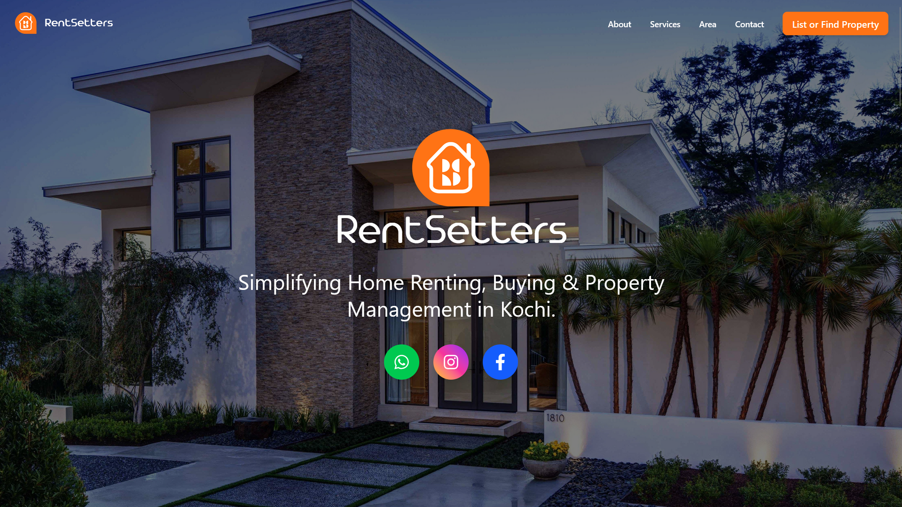
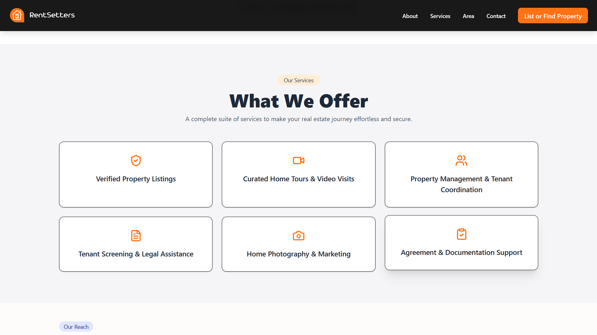

RentSetters – Coming Soon Landing Page

This is the official RentSetters landing page, built using React (Vite) and Tailwind CSS.
The page includes a modern navbar, smooth animations, custom branding, and links for property enquiries.

🚀 Features

- Responsive navbar with scroll effects
- Smooth hover animations using Framer Motion
- Simple “List or Find Property” button linked to Google Form
- Clean and fast landing layout
- Mobile-friendly dropdown menu

🛠 Tech Used

- React (Vite)
- Tailwind CSS
- Framer Motion
- React Icons

  
  

